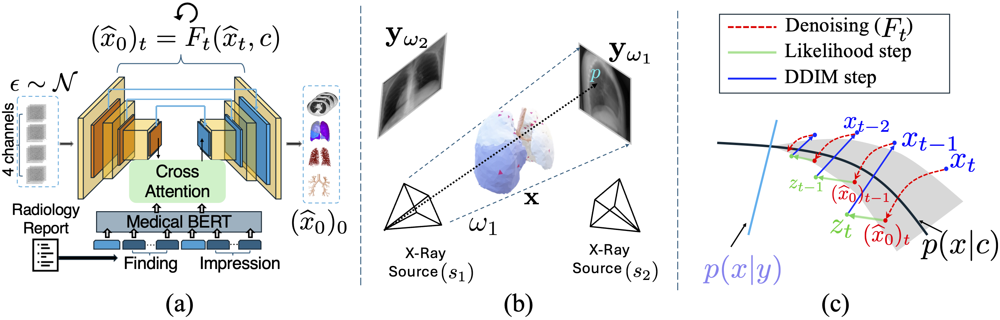

# <div align="center">PhyDiCT: Plug-and-Play CT Reconstruction from Sparse X-Rays via Differentiable Rendering and Strong Priors</div>

<p align="center">
<b>Weicheng Dai</b><sup>1</sup>,
Shantanu Ghosh<sup>1</sup>,
Kayhan Batmanghelich<sup>1</sup>  
<br/>
<sup>1</sup>Department of Electrical and Computer Engineering, Boston University  
</p>

<p align="center">
<i>MICCAI 2026</i>
</p>

<p align="center">
<!-- Activate upon release -->
<!-- <a href=""></a> -->
</p>

---

## 🧠 Overview

**PhyDiCT** is a **training-free, plug-and-play framework** for reconstructing **3D lung CT volumes from sparse X-ray projections**.

The method integrates:
- A **differentiable physics-based forward model** grounded in the Beer–Lambert law
- A **frozen, text-conditioned diffusion model** as a strong 3D CT prior
- **Split Gibbs sampling** to jointly enforce projection fidelity and prior consistency

Without any task-specific training or fine-tuning, PhyDiCT **outperforms fully trained CT reconstruction methods**, achieving up to **+7.5% SSIM** on public 3D CT benchmarks.

---

## ✨ Key Features

- 🔧 **Training-free inference** (no paired X-ray / CT supervision)
- 🔬 **Explicit physics modeling** via differentiable X-ray rendering
- 🧠 **Strong generative priors** from pretrained diffusion models
- 🔁 **Plug-and-play sampling** compatible with sparse-view settings
- 🧩 **Test-time refinement** for enhanced realism and anatomical coherence

---

## 🧩 Method at a Glance

<p align="center">

</p>

PhyDiCT performs inference by alternating between:
1. **Physics consistency** — matching rendered projections to observed X-rays
2. **Prior realism** — denoising with a frozen diffusion model

This formulation allows flexible, stable reconstruction without retraining the prior.

---

## 📊 Results Summary

We evaluate PhyDiCT on **public 3D lung CT datasets** using:
- Perceptual metrics (SSIM, PSNR)
- Semantic and structural consistency metrics
- Volumetric evaluations

**Key finding:**  
Combining a strong generative prior with explicit imaging physics substantially improves reconstruction quality compared to both plug-and-play diffusion baselines and fully trained models.

---

## 📦 Code Status

The full release will include:
- Plug-and-play diffusion sampling code
- Reproducibility instructions

### 0. Acquire [MedSyn](https://github.com/batmanlab/MedSyn/tree/main) weights from [github](https://github.com/batmanlab/MedSyn/tree/main#pretrained-checkpoint)
PhyDiCT is a pure training free method, but the pretrained weights are required for plausible results.

### 1. Create environment 
``` 
conda env create -f environment.yml 
```

### 2. Prepare your X-ray images

Here's an example from CT 

```
from DiffDRR import Reconstruction

high_res_folder = 'YOUR CT FOLDER'
input_CT_name = 'YOUR CT NAME'
input_CT = os.path.join(high_res_folder, input_CT_name)
img = torch.from_numpy(np.load(input_CT)).to('cuda')
with torch.no_grad():
    all_condition = []
    for angle in [0, 45, 90, 135, 180, 225, 270, 315]:
        recon = Reconstruction(img.squeeze(), img.device)
        angle = torch.tensor(angle)/360
        rot = torch.tensor([[0, angle.item()*np.pi*2, 0.0]], device=img.device)
        xyz = torch.tensor([[0.0, 950.0, 0.0]], device=img.device)
        pose = convert(rot, xyz, parameterization="euler_angles", convention="ZXY")
        condition = recon(pose)
        print('IMPORTANT, PLEASE VISUALIZE THE ESTIMATED X-RAY IMAGE TO CHECK IF IT IS REASONABLE \n and use the commented code if necessary')
        # condition = condition.contiguous().transpose(-1, -2).flip(-1).clone()
        condition = (condition - condition.mean())/condition.std()
        all_condition.append(condition)
    condition = torch.cat(all_condition, dim=0)
```
you can also refer to our [example X-rays](https://github.com/batmanlab/PhyDiCT/example_xrays), but this is just for reference.

### 3. Prepare your sample report 
Here's an example 
```
cd src
python extract_text_feature.py --prompt 'There is no airspace opacity, effusion or pneumothorax. There is no evidence of suspicious pulmonary nodule or mass.' \
                               --text_model_path './model/pretrained_lm' \
                               --save_path './result/text_feature/normal.npy'
```

### 4. Run the main PhyDiCT 
```
cd src
python eval_low_PhyDiCT.py \
--pretrain_model_path './model/results_text_low_res_improved_unet_seg/' \
--save_path 'tmp/results_phydict_low_res'
```

Please pay attention to the 3D spatial features and the 2D projections. 
If necessary please visualize after [line 113](https://github.com/batmanlab/PhyDiCT/blob/8af688b6efc738b5340179bbb52b88fa93f570c9/src/eval_low_PhyDiCT.py#L113) to make sure you don't need to transpose or flip. 
The results will be stored in `tmp/results_phydict_low_res/add_t_0.8` if default values are used. 

### 5. Run the super res branch (same to MedSyn)
```
cd src
python eval_super_res.py \
--low_res_folder 'tmp/results_phydict_low_res/add_t_0.8' \
--pretrain_model_path './model/results_SR_gaussian_aug_full_volume_seg/' \
--save_path 'tmp/results_phydict_high_res/'
```

### If there's any issue with implementation, please let us know.

---

## 📚 Citation

If you find this work useful, please cite:

```bibtex
@inproceedings{dai2026phydict,
  title     = {PhyDiCT: Plug-and-Play CT Reconstruction from Sparse X-Rays via Differentiable Rendering and Strong Priors},
  author    = {Dai, Weicheng and Ghosh, Shantanu and Batmanghelich, Kayhan},
  booktitle = {Medical Image Computing and Computer Assisted Intervention (MICCAI)},
  year      = {2026}
}
```

Also MedSyn:
```
@ARTICLE{medsyn2024,
  author={Xu, Yanwu and Sun, Li and Peng, Wei and Jia, Shuyue and Morrison, Katelyn and Perer, Adam and Zandifar, Afrooz and Visweswaran, Shyam and Eslami, Motahhare and Batmanghelich, Kayhan},
  journal={IEEE Transactions on Medical Imaging}, 
  title={MedSyn: Text-guided Anatomy-aware Synthesis of High-Fidelity 3D CT Images}, 
  year={2024},
  doi={10.1109/TMI.2024.3415032}}
```

## License and Copyright
Please see [LICENSE.txt](https://github.com/batmanlab/PhyDiCT/blob/main/LICENSE.txt)

## Credits
The code is heavily based on [MedSyn](https://github.com/batmanlab/MedSyn/tree/main) and [DiffDRR](https://github.com/eigenvivek/DiffDRR). 